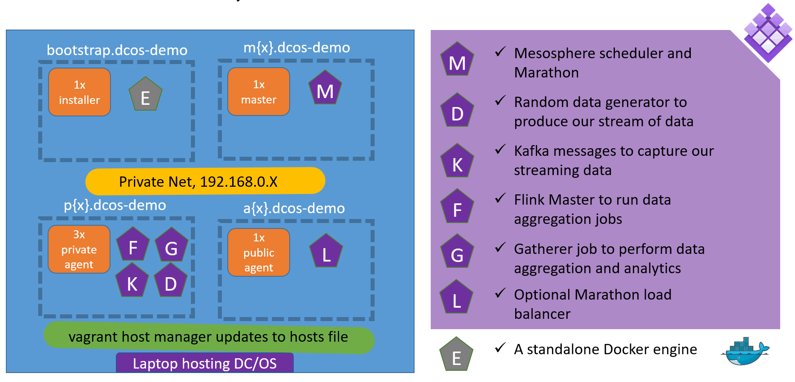

# Introduction

This is a data pipeline demo project for learning how to work with components such as [Kafka](http://kafka.apache.org/), [Flink](http://flink.apache.org/) and [Marathon apps](https://dcos.io/docs/1.9/deploying-services/install/) on [DC/OS](https://dcos.io/) to analyze data.  We will setup the following demo environment:



This demo was designed for running DC/OS and all required components on local laptop and not intended for production usage.

You can also find other cool vagrant and DC/OS demos here:
- https://github.com/dcos/dcos-vagrant.git
- https://github.com/dcos/demos

## Requirements

1. You'll need [vagrant (recommend 1.9.4)](https://www.vagrantup.com/).
2. (Optional) All build steps can be performed on the bootstrap node, but you can also perform build steps on a local [docker engine](https://github.com/moby/moby/releases/tag/v1.13.1).  For example, install [docker-machine to build the demo app](https://github.com/docker/machine/releases/tag/v0.11.0).  
3. A system with about ~16G of RAM, and 8 Cores.  This demo was built on macOS 10.12.3.  SSD drive is highly desirable.  An internet connection with 10 mBits / sec or better.

## Time Estimate

- Allow 60 minutes for vagrant up to complete.
- Allow 30 minutes for DC/OS deployment steps.

## How to prepare

1. (optional) trying to go passwordless?  Visit [these instructions](https://github.com/devopsgroup-io/vagrant-hostmanager#passwordless-sudo) or run these steps:
   ```
   curl -o /tmp/passwordless.sh \
        --url 'https://raw.githubusercontent.com/dcos/dcos-vagrant/master/ci/passwordless.sh' && \
        sudo bash /tmp/passwordless.sh ; \
        rm -f /tmp/passwordless
   ```
1. generate some keys if you haven't done that yet, we'll need those in the keys directory:
   ```
   cd keys && ./genkeys.sh && cd ..
   ```
   NOTE: These keys can not be encrypted, as the DC/OS installation will be using them for an unattended installation.
1. run vagrant up!  `vagrant up` in the root directory of this project.
1. At this point, you might want to take snap shots of all VMs so that you can repeat the DC/OS deployment iteratively with different configurations.

## What have we done so far and whats next?

At this point you should have setup 6 nodes for deploying DC/OS.
 - 1 bootstrap for docker commands and DC/OS installation
 - 1 master for DC/OS operations
 - 1 public agent for application routing with Marathon LB
 - 3 private agents for all component deployments

This should allow us to continue to deploy the data pipeline demo.

The goals are simple.  Learn how to [deploy DC/OS](https://dcos.io/docs/1.9/installing/custom/) and manage a simple data pipeline.

The vagrant setup performed the following actions, now it's time to continue to the DC/OS deployment:

- We installed docker only on the bootstrap node.
- We configured the ssh key in the keys folder to allow for an ssh based deployment.
- We installed minimal packages on all nodes.
- We generated the basic configuration file from the [genconf/config.yaml](genconf/config.yaml)

## Manual DC/OS deployment

We perform the installation manually to tune the DC/OS environment just right for the target laptop.  A minimum setup has been prepared, but adjustments might need to be made to the configuration.

1. Connect to the bootstrap node: `vagrant ssh bootstrap.dcos-demo`
2. Change to dcos_install folder : `cd /opt/dcos_install`
3. Install all the node pre-reqs:  `sudo bash ./dcos_generate_config.sh --install-prereqs -v`
4. Verify we can install with pre-flights: `sudo bash ./dcos_generate_config.sh --preflight -v`
4. Deploy DC/OS: `sudo bash ./dcos_generate_config.sh --deploy -v`
5. Verify install is good with post-flights: `sudo bash dcos_generate_config.sh --postflight -v`
6. Setup the [dcos client](docs/dcoscli.md).

Once all these steps are complete, try accessing the DC/OS environment with a local browser at the following URL: ***[http://m1.dcos-demo](http://m1.dcos-demo)***

Tweak the Vagrantfile and genconf/config.yaml for other configurations.  For example, 3 masters, 1 agent, 1 public agent.

## A real demo

Now lets do a [the data pipeline demo](demo/README.md)!

## Trouble shoot

We can start with [this site](https://dcos.io/docs/1.9/installing/troubleshooting/), however lets provide some [specific help with the vagrant VMs](docs/TROUBLESHOOTING.md).
