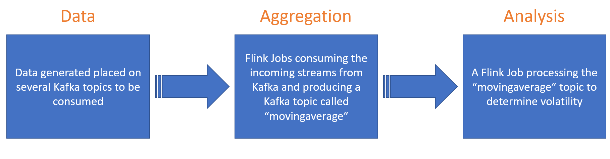

# Gather, Aggregate, and Analyze streaming data with flink



The `gatherer` project contains a demo flink class that can be used and scheduled
on flink to produce a moving average mean and standard deviation calculation
on a data set from kafka topic.  The results are placed on another kafka stream
for analysis.  In this way we can aggregate data from several streams by
launching several flink jobs to work in concert to aggregate data.

The `movingaverage` topic will produce a stream of the standard deviation every
topic being monitored.  This stream will be updated every 10 seconds over a 10 minute
window that started with a 10 minute negative offset, so that we have a sufficient
sampling of data.  The mean, standard deviation and current value can give some
potential prediction of the future volatility of the next numbers.

# Lets build it

Use the build script if your working on adjusting the code or producing a new package.  If your not modifying the code, skip to installation to run all required flink jobs. You can develop this code on [Intellij](../../docs/intellij.md) as well.

```
bash ./build.sh
```

After the build, the sub-folder called `target` will contain the produced jar file to upload into flink.  Use the file:
`gatherer-1.0-SNAPSHOT-jar-with-dependencies.jar`

This file will contain all classes and dependent libraries required.

# Lets schedule it on flink

We run the flink aggregation and analytics jobs as a DC/OS service using a docker container with dockerizer.

Execute the following command on a system with the DC/OS client installed:

```
bash ./install.sh
```

# Lets watch the output

We can watch the results of the calculations on the `movingaerage` topic.
This can be accomplished with the following docker command on one of the
nodes in the DC/OS cluster.  Lets run this on the bootstrap node.

1. Connect to the bootstrap node `vagrant ssh bootstrap.dcos-demo`
2. Run a kafka client to consume the `movingaverage` topic.
   ```
   docker run -it --rm mesosphere/kafka-client \
     ./kafka-console-consumer.sh --zookeeper 192.168.0.3:2181/dcos-service-kafka \
     --topic movingaverage
   ```
3. Check the `volatility` topic to see what the current volatility is.  
   ```
    docker run -it --rm mesosphere/kafka-client \
      ./kafka-console-consumer.sh --zookeeper 192.168.0.3:2181/dcos-service-kafka \
      --topic volatility
   ```

   We can adjust the confidence index on the DC/OS Marathon app by adjusting the environment variable called `CONF_INDEX`.  The default is set in the `service-volatility.json` file.  This will allow the volatility to display
   `high` or `low` based on what the current coefficient of variation is.  It's
   nice to see that scheduling the analysis under DC/OS allows us to adjust
   measurements without impacting other analysis tracking that is actively in progress.

# Understanding the results

## MovingAverage Class

You might see output like the following if you have two flink jobs running on the `London` and `NYC` topics.

```
67 London 2146 319036 4761 3064 64.356224
76 NYC 4908 382279 5029 2822 56.114536
75 NYC 4908 381482 5086 2798 55.013763
66 London 2146 311130 4714 3062 64.95545
73 NYC 4908 365097 5001 2784 55.668865
67 London 5723 316853 4729 3042 64.32649
73 NYC 4908 365097 5001 2784 55.668865
68 London 8896 316462 4653 2989 64.23813
74 NYC 5745 370842 5011 2766 55.198563
```
The columns each represent the following:
- column 1 - sample size
- column 2 - label from where the aggregated topic is produced from
- column 3 - The last price
- column 4 - The sum of the total sample size
- column 5 - The calculated mean of the sample size
- column 6 - The standard deviation for the given sample size
- column 7 - The coefficient of variation

## Volatility Class

The results of the MovingAverage jobs is collected in the `movingaverage` topic and stored analyzed by the Volatility jobs.  The results are placed in the `volatility` topic to be used.

The data for `NYC` might look like the following:

```
London 2 51 5371 48.831757 low
NYC 2 51 5317 54.468018 high
London 2 51 5327 48.400185 low
NYC 2 51 5337 54.407715 high
London 2 51 5440 47.034096 low
NYC 2 51 5378 53.472946 high
NYC 2 51 5507 52.478664 high
London 2 51 5573 45.85761 low
NYC 2 51 5525 51.244358 high
London 2 51 5514 47.025703 low
NYC 2 51 5531 51.528267 high
```

The columns each represent the following:
- column 1 - label from where the aggregated topic is produced from
- column 2 - sample size for volatility window
- column 3 - the confidence index (input)
- column 4 - the average mean
- column 5 - the average coefficient of variation
- column 6 - the state of volatility, low < the current confidence index, high is >.
