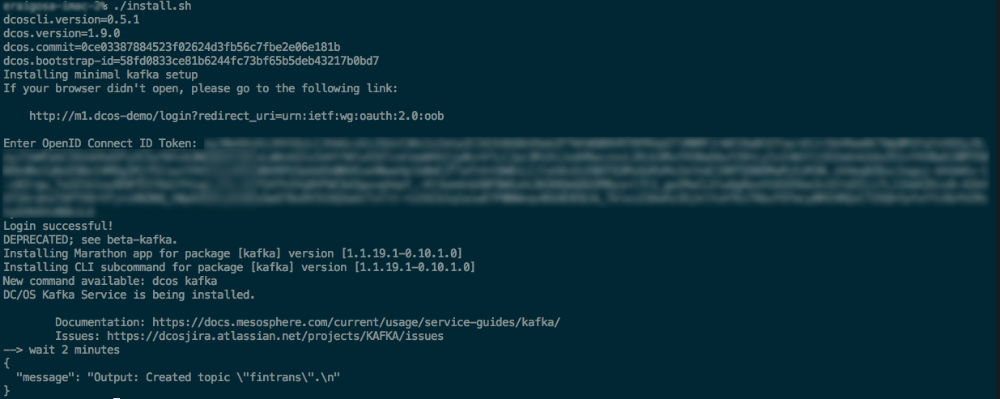

# Kafka setup

This folder contains a simple minimal Kafka setup and topic deployment.

- Documentation can be found [here](https://docs.mesosphere.com/current/usage/service-guides/kafka/).
- Source docs can be found [here](https://github.com/mesosphere/dcos-kafka-service/blob/master/docs/configure.md).

# setup
Run the following script to setup:

```
./install.sh
```


